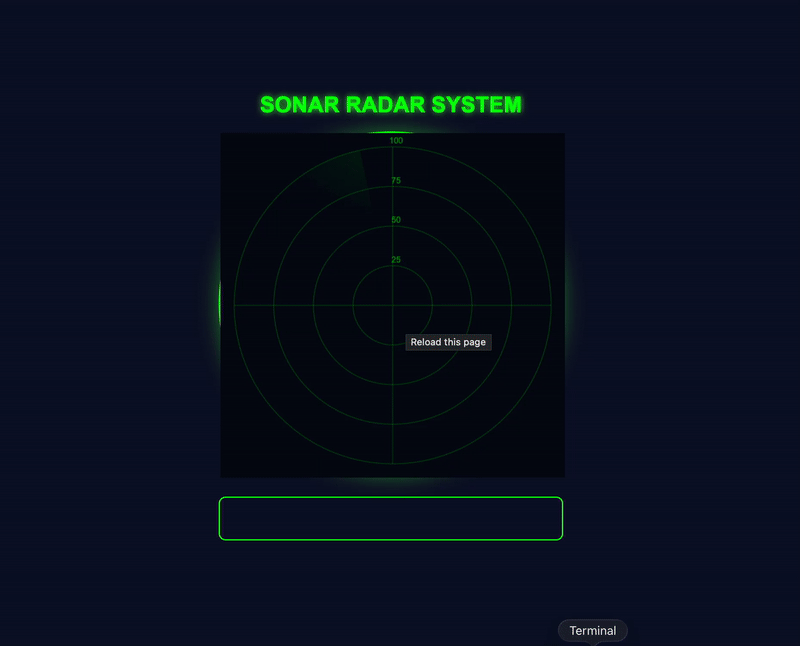

# Centralized Multicast Processing System

A comprehensive system for collecting, processing, and real-time visualization of UDP multicast packets from ESP32 IoT devices on a Java Spring Boot server.

## 📋 About the Project

This system collects sensor data from multiple IoT devices in a centralized server by:
- **Receiving data** via UDP Multicast
- **Providing real-time communication** through WebSocket
- **Visualizing data** on a Web Dashboard
- **Processing packets** containing timestamp, track number, priority, payload, and coordinate information

## 🏗️ System Architecture

```
ESP32 Devices (Multicast Listener)
    ↓
    └─→ UDP Multicast

Spring Boot Server
    ├─→ Multicast Listener and Sender (PacketManager)
    ├─→ WebSocket Server (WebSocketConfig)
    └─→ Web Dashboard (HTML/JS/CSS)
         ↓
    Web Browser (Sonar Visualization)
```

## Technology

### Backend
- **Java 17**
- **Spring Boot 3.2.1**
  - Spring Web (REST API)
  - Spring WebSocket (STOMP)
- **Maven** (Build Tool)
- **UDP Sockets** (Multicast Communication)

### Frontend
- **HTML5**
- **CSS3**
- **JavaScript** (WebSocket Client)
- **Canvas API** (Sonar Visualization)

## 📁 Project Structure

```
Centralized-Multicast-Processing-System/
├── README.md
├── centralized_multicast_processing_system/
│   ├── config.properties              # Server and multicast configuration
│   ├── pom.xml                        # Maven dependencies
│   └── src/
│       ├── main/
│       │   ├── java/com/example/centralized_multicast_processing_system/
│       │   │   ├── CentralizedMulticastProcessingSystemApplication.java
│       │   │   ├── PacketContent.java          # Packet data model
│       │   │   ├── PacketManager.java          # Packet processing and conversion
│       │   │   ├── WebSocketConfig.java        # WebSocket configuration
│       │   │   └── WebSocketSender.java        # WebSocket sending service
│       │   └── resources/static/
│       │       ├── sonar.html                  # Main dashboard
│       │       ├── css/sonar.css               # Style sheet
│       │       └── js/sonar.js                 # Client-side logic
│       └── test/
│           └── java/.../AppTest.java
└── ESP32_Multicast_Listener/
    └── esp32_multicast_listener.ino   # ESP32 multicast listener firmware
```


## Getting Started

### Prerequisites
- Java 17 or higher
- Maven 3.6+
- ESP32 board with WiFi connectivity
- Modern web browser

### Installation

#### 1. Backend Setup

```bash
# Navigate to project directory
cd centralized_multicast_processing_system

# Build with Maven
mvn clean install

# Run the application
mvn spring-boot:run
```

The server will run on `http://localhost:8080` by default.

#### 2. ESP32 Firmware Installation

1. Open Arduino IDE
2. Load the file `ESP32_Multicast_Listener/esp32_multicast_listener.ino`
3. Install required libraries:
   - AsyncUDP
   - WiFi (Built-in)
   - Preferences (Built-in)
4. Configure WiFi credentials
5. Upload to ESP32

#### 3. Web Dashboard

Open the following address in your browser:
```
http://localhost:8080/sonar.html
```

## Packet Data Structure

Each packet contains the following information:

| Field | Type | Size | Description |
|-------|------|------|-------------|
| Timestamp | String | Variable | Data creation time |
| Track Number | Integer | 4 bytes | Particle/object number |
| Priority | Integer | 4 bytes | Data priority |
| Payload | String | Variable | Data content |
| X_coordinate | Integer | 4 bytes | X-axis coordinate |
| Y_coordinate | Integer | 4 bytes | Y-axis coordinate |


## Web Dashboard Features

- **Sonar Visualization**: Real-time sonar radar view
- **WebSocket Connection**: Automatic connection via STOMP protocol
- **Live Data Stream**: Real-time packet display
- **Responsive Design**: Works on different screen sizes
